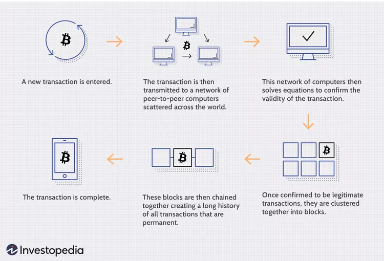

# The Blockchain
* [URL](https://www.coursera.org/learn/uciblockchain?action=enroll&specialization=uci-blockchainhttps%3A%2F%2Fwww.coursera.org%2Flearn%2Fuciblockchain%3Fspecialization%3Duci-blockchain)
* Textbook 
  * [The Internet of Money](https://www.amazon.com/Internet-Money-Andreas-M-Antonopoulos/dp/194791006X/ref=tmm_pap_swatch_0?_encoding=UTF8&qid=1559232641&sr=8-3)
  * [Blockchain Basics](https://www.amazon.com/Blockchain-Basics-Non-Technical-Introduction-Steps-dp-1484226038/dp/1484226038/ref=mt_paperback?_encoding=UTF8&me=&qid=1559232841https://www.amazon.com/Blockchain-Basics-Non-Technical-Introduction-Steps-dp-1484226038/dp/1484226038/ref=mt_paperback?_encoding=UTF8&me=&qid=1559232841)

## Module 1

### Foundations of Blockchain and Digital Currencies

#### Assignment 1 
**What is blockchain**: The blockchain is essentially a distributed database (ledger) that keeps a record of transactions, 
specifically in cryptocurrency, across multiple machine linked via P2P network.  

**How does it work**: The blockchain is essentially aa distributed database that keeps a record of everything that happens
on the P2P network. Unlike other ledgers, (meta)data on the blockchain is non-fungible (ie cannot be changed).    
* **Step 1**: A user requests a new transaction
* **Step 2**: data is distributed across P2P network 
* **Step 3**: Validate the data using complex algorithm verification
* **Step 4**: Write the transaction on the blockchain (this could be multiple steps)
* 

[Investopedia](https://www.investopedia.com/terms/b/blockchain.asp)

**What kind of Blockchain companies are you currently aware of or interested in**: The idea of blockchain can be utilized 
in just about any industry; from finance, to data management nad security. Below is a subset of topics and corresponding 
companies: 
* Private blockchain -- Hyperledger 
* Finance -- Litconin
* Data storage -- filecoin
* DiPin - - Dimo
* IoT -- AIOT
* Services to store and sell crypto -- Coinbase, Binance,  crypto.com

**Do you have a business idea for a new blockchain company**: I'm part of a project called [AnyLog](https://anloy.co) which
allows to manage (IoT and real-time) data directly at the edge. It is using the blockchain to manage the network's metadata
layyer.

#### Quiz
1. Which one of the following actions involving a digital camera is associated with the **APPLICATION** layer?
   * Selecting the zoom level when framing a photograph. 
   * Storing the image in JPEG format. 
   * When saving an image, inserting a timestamp into each image’s file name. 
   * Applying a file compression algorithm to increase storage capacity.

The answer can be found in Drescher: Step 1.

2. Which one of the following actions involving an airline reservation website is associated with the **IMPLEMENTATION** layer?
Holding a reservation for five minutes while the payment is processed.

3. The center node in a centralized cellular telephone system fails. What happens next (choose the BEST answer)?
Nobody will be able to communicate

4. Why are distributed systems (such as the Internet) considered to be more reliable than non-distributed systems?
If one internet server (node) fails, data can be rerouted through alternate pathways.

5. Which of the following is NOT a distributed system?
An automobile’s electrical system.

6. Which one of the following is a characteristic of a digital currency such as bitcoin?
It is used to communicate value, albeit in a decentralized manner

7. Which type of currency system relies on intermediaries to carry out transactions? 
National currencies.

8. What is the fundamental reason for implementing a blockchain?
Ensure integrity in a distributed system.

9. Suppose your local economy is experiencing double-digit inflation. How will the value of your bitcoin holdings change?
It is not possible to determine precisely how bitcoin value will change because it is not tied to national or institutional banks.

10. Why is bitcoin so revolutionary? (Choose the BEST answer.)
It allows monetary transactions to take place in a distributed, decentralized manner without needing to trust a central authority.
